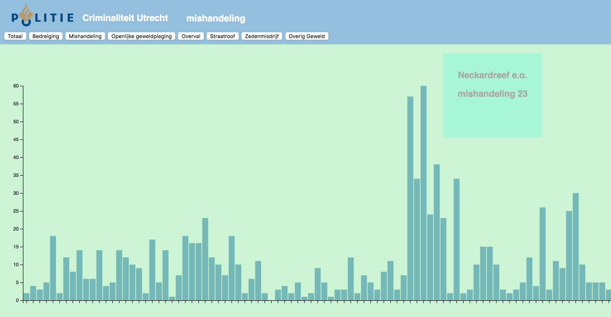

Graph by : [@D3Noob](https://bl.ocks.org/d3noob)<br>
Customisation by : [@muise001](https://github.com/muise001)

# Assessment 2

Assessment 2 was een combinatie tussen verschillende huiswerkopdrachten. Als eerste de opdrachten waarbij we data in een al bestaande grafiek moesten zetten, en de opdracht waarbij we code moesten schoonmaken.

## Features
* __Futuristic Animations__ - De "Futuristische animaties" heb ik gemaakt door simpelweg ```.transition()``` en ```.duration()``` toe te voegen __boven__ een aantal ```.attr()``` functies
* __The Swift Graph Switcher__ - De "SGS" (Swift Graph Switcher) bestaat uit een aantal knoppen in de header. Hiermee kan je kiezen welke grafiek je wilt zien. Dan wordt de data van de grafiek aangepast. 
* __Ultimate Data Indicator__ - Als je op een van de 'bars' klikt, dan zie je rechts in het scherm het exacte aantal van het aantal misdaden met de buurt erbij
* __Realistic SFX__ - Als je op een van de buttons in de header klikt, hoor je een leuk geluidje :upside_down_face:

## struikelblokken
* __Data cleanen__ - Het grootste struikelblok was voor mij het schoonmaken van de data. Uiteindelijk is het ook niet gelukt. Ik wist niet hoe ik ```data.forEach(function(d) { }``` kon gebruiken met schoongemaakte code
* __Veel grafieken__ - Als tweede had ik moeite met de "SGS" (Swift Graph Switcher). Als eerst zat ik lang te K*tten met de code schrijven zodat er uberhaupt nog een grafiek zichtbaar was. Uiteindelijk liet hij de "nieuwe" grafiek wel zien, maar onder de "oude". Dit heb ik opgelost om na het klikevent de ```<div>``` waar de ```<svg>``` instond leeg te maken, direct na het klikken

### bronnen
* __[D3Noob](https://bl.ocks.org/d3noob/bdf28027e0ce70bd132edc64f1dd7ea4)__ - Grafiek
* __[Overheid](https://data.overheid.nl/data/dataset/geweld)__ - Dataset
* __[Soundsnap](https://www.soundsnap.com/tags/police_siren)__ - Geluidje
